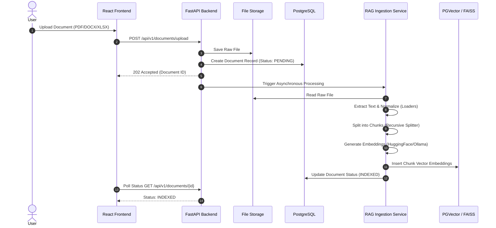
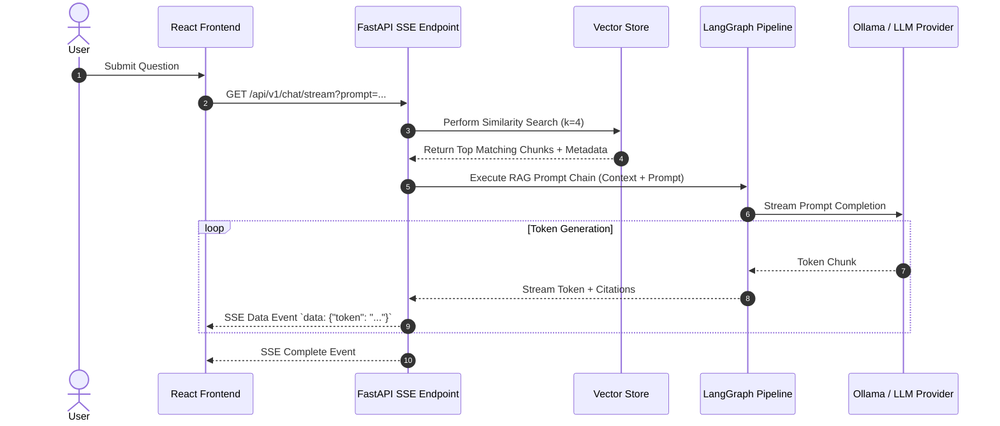

# System Sequence Diagrams

## 1. Document Ingestion & Vector Indexing Sequence

```mermaid
sequenceDiagram
    autonumber
    actor User
    participant UI as React Frontend
    participant API as FastAPI Backend
    participant Storage as File Storage
    participant DB as PostgreSQL
    participant AI as RAG Ingestion Service
    participant VectorDB as PGVector / FAISS

    User->>UI: Upload Document (PDF/DOCX/XLSX)
    UI->>API: POST /api/v1/documents/upload
    API->>Storage: Save Raw File
    API->>DB: Create Document Record (Status: PENDING)
    API-->>UI: 202 Accepted (Document ID)
    
    API->>AI: Trigger Asynchronous Processing
    AI->>Storage: Read Raw File
    AI->>AI: Extract Text & Normalize (Loaders)
    AI->>AI: Split into Chunks (Recursive Splitter)
    AI->>AI: Generate Embeddings (HuggingFace/Ollama)
    AI->>VectorDB: Insert Chunk Vector Embeddings
    AI->>DB: Update Document Status (INDEXED)
    
    UI->>API: Poll Status GET /api/v1/documents/{id}
    API-->>UI: Status: INDEXED
```

---

## 2. RAG AI Chat Streaming Sequence

```mermaid
sequenceDiagram
    autonumber
    actor User
    participant UI as React Frontend
    participant API as FastAPI SSE Endpoint
    participant VectorDB as Vector Store
    participant Graph as LangGraph Pipeline
    participant LLM as Ollama / LLM Provider

    User->>UI: Submit Question
    UI->>API: GET /api/v1/chat/stream?prompt=...
    API->>VectorDB: Perform Similarity Search (k=4)
    VectorDB-->>API: Return Top Matching Chunks + Metadata
    
    API->>Graph: Execute RAG Prompt Chain (Context + Prompt)
    Graph->>LLM: Stream Prompt Completion
    
    loop Token Generation
        LLM-->>Graph: Token Chunk
        Graph-->>API: Stream Token + Citations
        API-->>UI: SSE Data Event `data: {"token": "..."}`
    end
    
    API-->>UI: SSE Complete Event
```
